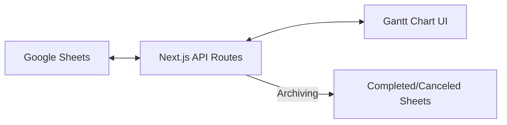

# 🎨 [Design] Sheet Gantt Manager (v1.5.8)

## 1. 개요 (Executive Summary)

| 항목 | 상세 내용 |
| :--- | :--- |
| **작업명** | Sheet Gantt Manager 상세 설계 |
| **핵심 목적** | Google Sheets API 연동 아키텍처 및 상태 기반 아카이빙 로직 설계 |
| **상태** | In Progress (Design Phase) |

---

## 2. 시스템 아키텍처 (System Architecture)

### 2.1 데이터 흐름 (Data Flow)

- **Next.js API Routes:** Google Sheets API와의 보안 연동 및 비즈니스 로직(아카이빙) 처리.
- **Vercel Serverless:** API 요청 처리 및 렌더링 최적화.

### 2.2 Google Sheets API 연동 (v4)
- **Auth:** Service Account (JSON Key)를 통한 서버 측 인증.
- **Operations:**
    - `spreadsheets.values.get`: 데이터 로딩.
    - `spreadsheets.values.append`: 아카이빙 시트(Completed/Canceled)에 데이터 추가.
    - `spreadsheets.batchUpdate`: 메인 시트에서 아카이빙된 로우 삭제.

---

## 3. 핵심 비즈니스 로직 (Core Business Logic)

### 3.1 상태 기반 아카이빙 (Status Archiving)
- **트리거:** 웹 UI에서 특정 태스크의 `Status`를 `완료` 또는 `취소`로 변경 시.
- **프로세스:**
    1.  해당 태스크의 데이터를 추출.
    2.  `spreadsheets.values.append`를 호출하여 대상 시트(`Completed` 또는 `Canceled`)의 마지막 행에 추가.
    3.  `spreadsheets.batchUpdate`를 호출하여 메인 시트의 해당 인덱스(Row) 삭제.
    4.  클라이언트 측 UI 상태(State)에서 즉시 제거하여 차트 재렌더링.

### 3.2 간트 차트 필터링 및 렌더링
- **필터:** `Status`가 `진행`, `지연`, `보류`인 데이터만 렌더링.
- **색상 매핑:**
    - `진행`: `--primary` (#3b82f6)
    - `지연`: `--destructive` (#ef4444)
    - `보류`: `--secondary` (#64748b)

---

## 4. UI/UX 컴포넌트 설계

### 4.1 GanttChartContainer
- **역할:** Google Sheets API 데이터 페칭 및 전역 상태 관리.
- **컴포넌트:** `GanttHeader`, `Timeline`, `TaskList`, `TaskItem`.

### 4.2 TaskItem (상세 정보 및 상태 변경)
- **상태 드롭다운:** shadcn-ui `Select` 컴포넌트 활용.
- **이슈 강조:** `Issues` 필드에 내용이 있을 경우 경고 아이콘(`TriangleAlert`) 표시.

---

## 5. 작업 목록 (Implementation Checklist)

- [ ] Google Cloud Console 프로젝트 생성 및 API 활성화
- [ ] 서비스 계정(Service Account) 생성 및 시트 공유 설정
- [ ] `.env.local`에 서비스 계정 키 및 스프레드시트 ID 등록
- [ ] API 연동 유틸리티 (`lib/google-sheets.ts`) 구현
- [ ] Next.js API Routes (`/api/tasks`) 구현
- [ ] 간트 차트 UI 컴포넌트 구현 및 `mps-design-system` 적용
- [ ] 아카이빙 로직 테스트 및 예외 처리
